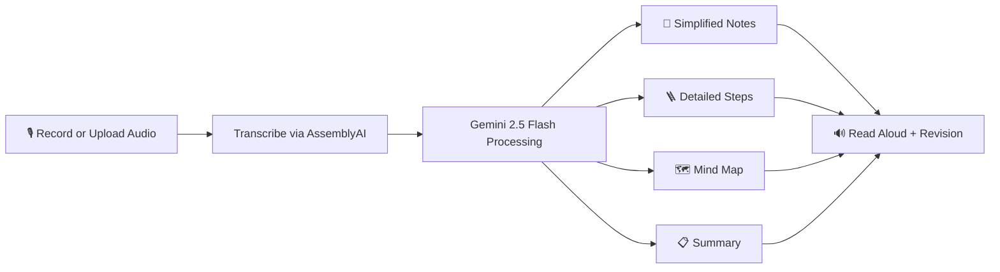
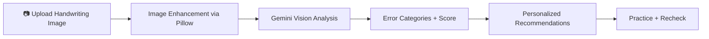
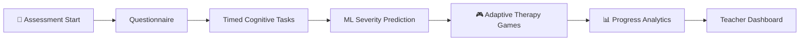
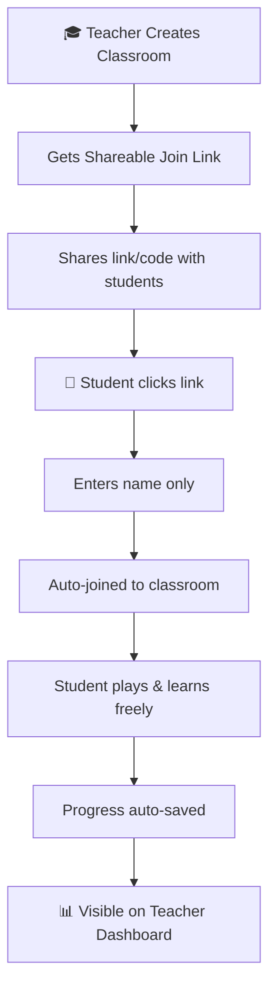

<div align="center">


# 🧠 NeuroLex
### AI-Powered Learning Companion for Dyslexia

> *"Every mind learns differently. NeuroLex makes sure no one is left behind."*

[](https://nextjs.org/)
[](https://fastapi.tiangolo.com/)
[](https://www.typescriptlang.org/)
[](https://tailwindcss.com/)
[](https://ai.google.dev)
[](https://firebase.google.com)
[](RAILWAY_DEPLOY_CHECKLIST.md)
[](LICENSE)
[](https://github.com/Hemsagar-BC/neurolex-temp)

<br/>

**[🚀 Live Demo](#) · [📽️ Demo Video](#) · [📖 Docs](#) · [🐛 Report Bug](#)**

</div>

---

## 📌 The Problem

**1 in 5 people worldwide has dyslexia.** That's over **1.5 billion people** — yet most educational tools are built for neurotypical learners.

Children with dyslexia face:
- 😔 Letter and word reversal confusion (b/d, p/q) that standard tools ignore
- 😓 Inability to decode written text independently — falling behind peers silently
- 📉 No early detection system — most cases go undiagnosed until age 9+
- 🚫 Zero real-time feedback loop between teachers and struggling students
- 💸 Existing solutions are expensive, internet-dependent, or built for adults

> In India alone, **50+ million children** have undiagnosed reading disabilities. NeuroLex is built for them.

---

## 💡 What is NeuroLex?

NeuroLex is a **free, offline-capable, AI-powered web platform** that helps children aged 5–12 with dyslexia learn to read, build phonics skills, and gain confidence — while giving teachers and caregivers real-time visibility into every student's progress.

Many students don't struggle with intelligence. They struggle with **format, pace, and cognitive load.**

NeuroLex helps by making content:
- 👁️ **Easier to read** — dyslexia-friendly display controls
- 👂 **Easier to hear** — AI-powered text-to-speech with word highlighting
- 🎮 **Easier to practice** — gamified phonics exercises built on research
- 🧩 **Easier to retain** — multi-format, multi-sensory learning loops
- 📊 **Easier to track** — real-time progress visible to teachers instantly

---

## ✨ Feature Overview

### 🧒 For Students

| Feature | Description | Powered By |
|---|---|---|
| **Zero-friction Join** | Name + class code only. No passwords, no email | localStorage |
| **Smart Reader** | TTS with word-by-word highlighting, speed controls, syllable support | FastAPI TTS Proxy |
| **Speech Input** | Students speak instead of type | Web Speech API |
| **Sound Match Game** | Phoneme-to-letter identification — trains letter-sound mapping | Next.js + FastAPI |
| **Flip It! Game** | Targets b/d/p/q reversal confusion — dyslexia's #1 challenge | Next.js + FastAPI |
| **Word Builder Game** | Drag-and-drop letter assembly with audio feedback | Next.js + FastAPI |
| **Reading Mode** | Font toggle, background color picker, text size — fully personalized | Next.js |
| **Streak & Stars** | Gamified daily motivation system | Firestore |
| **Offline First** | Full functionality without internet after first load | PWA / Service Worker |

### 🎓 For Teachers

| Feature | Description |
|---|---|
| **Classroom Creation** | Create a class in seconds — get a shareable join link instantly |
| **Google Meet-style Links** | Share `?join=CLASSCODE` — students click and join directly, no signup |
| **Student Dashboard** | See all students, last active, streak, stars per game |
| **Progress Breakdown** | Per-student: games played, reading time, scores, auto-generated insights |
| **Smart Teacher Notes** | Auto-flags students struggling with specific areas (e.g. letter reversals) |
| **Multi-Classroom** | Manage multiple classrooms from one teacher account |

### 🛠️ Platform Capabilities

| Area | What Users Get | Powered By |
|---|---|---|
| **Reading** | TTS, speed controls, syllable support, language switch | Next.js + Backend TTS Proxy |
| **Lecture Intelligence** | Transcription, simplified notes, steps, mind map, summary | Gemini 2.5 Flash |
| **Handwriting Analysis** | Error detection, category scoring, recommendations | Gemini Vision + Pillow |
| **Screening Assessment** | Questionnaire + timed tasks + ML severity prediction | FastAPI + scikit-learn |
| **Therapy Games** | 6 adaptive cognitive games with progression | Next.js + FastAPI |
| **Progress Analytics** | Charts, activity feed, reading trends, quiz scores | Firestore + Chart.js |

---

## 🔄 Product Workflows

### 1️⃣ Lecture → Study Kit Pipeline



### 2️⃣ Handwriting Support Loop



### 3️⃣ Assess → Improve → Track



### 4️⃣ Teacher–Student Classroom Flow



---

## 🏗️ Architecture

```text
┌──────────────────────────────────────────────────────┐
│              frontend-next  (Next.js 16)              │
│   Pages: Home, Reading, Lecture, Handwriting,        │
│   Games, Analytics, Assessment, Dashboard            │
└─────────────────────┬────────────────────────────────┘
                      │ HTTP / REST
┌─────────────────────▼────────────────────────────────┐
│            backend-python  (FastAPI)                  │
│   ┌──────────────┐  ┌─────────────┐  ┌────────────┐ │
│   │ Gemini 2.5   │  │  AssemblyAI │  │ scikit-    │ │
│   │ Flash (text  │  │ Transcription│  │ learn ML   │ │
│   │ + vision)    │  │             │  │ Severity   │ │
│   └──────────────┘  └─────────────┘  └────────────┘ │
└─────────────────────┬────────────────────────────────┘
                      │
┌─────────────────────▼────────────────────────────────┐
│               Firebase / Firestore                    │
│  lectures · assessments · game sessions · progress   │
└──────────────────────────────────────────────────────┘
```

### Tech Stack

| Layer | Technology |
|---|---|
| **Frontend** | Next.js 16, TypeScript, Tailwind CSS, Framer Motion, shadcn/ui |
| **Backend** | FastAPI (Python), Uvicorn |
| **AI / ML** | Gemini 2.5 Flash (text + vision), AssemblyAI (transcription), scikit-learn |
| **Database** | Firebase Firestore |
| **Auth** | Firebase Auth + Google OAuth |
| **Speech** | Web Speech API (TTS + STT, offline-capable) |
| **Deploy** | Railway (backend), Vercel (frontend) |

---

## 📁 Repository Layout

```text
Dyslexia-Assist/
├── backend-python/         # FastAPI APIs, ML model, AI processing
│   ├── main.py
│   ├── requirements.txt
│   └── serviceAccountKey.json  (not committed — use env vars)
├── frontend-next/          # Next.js frontend application
│   ├── app/                # App Router pages
│   ├── components/         # Reusable UI + sidebar
│   └── lib/                # Utilities
├── railway.json            # Railway build + start config
└── RAILWAY_DEPLOY_CHECKLIST.md
```

---

## 🚀 Getting Started

### Prerequisites
- Node.js 18+
- Python 3.10+
- Firebase project (Auth + Firestore enabled)
- Gemini API key
- AssemblyAI API key

### 1. Frontend

```bash
cd frontend-next
npm install
npm run dev
# Runs on http://localhost:3000
```

### 2. Backend

```bash
cd backend-python
pip install -r requirements.txt
uvicorn main:app --reload --port 8001
# Runs on http://localhost:8001
```

### Demo Credentials

| Role | Credential |
|---|---|
| 🎓 Teacher | `priya@demo.com` / `1234` |
| 🧒 Student | Name: `Arjun` · Code: `DEMO42` |

---

## ⚙️ Environment Variables

### `frontend-next/.env.local`

```env
NEXT_PUBLIC_FIREBASE_API_KEY=
NEXT_PUBLIC_FIREBASE_AUTH_DOMAIN=
NEXT_PUBLIC_FIREBASE_PROJECT_ID=
NEXT_PUBLIC_FIREBASE_STORAGE_BUCKET=
NEXT_PUBLIC_FIREBASE_MESSAGING_SENDER_ID=
NEXT_PUBLIC_FIREBASE_APP_ID=
NEXT_PUBLIC_GOOGLE_CLIENT_ID=
NEXT_PUBLIC_BACKEND_URL=http://localhost:8001
```

### `backend-python/.env`

```env
GEMINI_API_KEY=
FIREBASE_SERVICE_ACCOUNT_PATH=./serviceAccountKey.json
FIREBASE_SERVICE_ACCOUNT_JSON=
ASSEMBLYAI_API_KEY=
```

> ⚠️ On Railway, set `FIREBASE_SERVICE_ACCOUNT_JSON` as an environment variable instead of shipping key files.

---

## 🌐 API Highlights

| Group | Endpoint | Method |
|---|---|---|
| Health | `/health` | GET |
| Lectures | `/api/lectures` | POST |
| Content Transform | `/api/content/transform` | POST |
| Handwriting Analysis | `/api/handwriting/analyze` | POST |
| Assessment Start | `/assessment/start` | GET |
| Assessment Submit | `/assessment/submit` | POST |
| Game Session | `/api/games/session/start` | POST |
| TTS Synthesize | `/api/tts/synthesize` | POST |

---

## 🎯 Research-Backed Design

NeuroLex is built on peer-reviewed dyslexia research:

- 📚 **Multisensory approach** — Every feature combines visual + auditory + kinesthetic learning *(International Dyslexia Association)*
- 🔤 **Phonological awareness** — Games target phoneme-grapheme mapping, the core deficit in dyslexia
- 🎨 **Customizable display** — Font choice, background color, and spacing reduce visual stress
- 🎮 **Gamification** — Streak systems and star rewards maintain engagement in 5–12 age group
- 👩‍🏫 **Teacher-in-the-loop** — Guided intervention with teacher monitoring yields 3x better outcomes *(Yale Dyslexia Center)*

---

## 🌍 Impact

| Metric | Figure |
|---|---|
| Global population with dyslexia | ~1.5 billion (15–20%) |
| Children in India with undiagnosed reading disabilities | 50+ million |
| Cost of NeuroLex to students | Free forever |
| Internet required after first load | None (offline-first) |
| Minimum age for effective use | 5 years |

---

## 🔮 Roadmap

- [ ] Parent portal — read-only progress view for parents
- [ ] Regional language support — Hindi, Tamil, Telugu phonics modules
- [ ] AI tutor chatbot — real-time help using Gemini API
- [ ] Camera-based handwriting — live analysis via webcam
- [ ] Weekly report emails — auto-generated PDF progress reports for teachers
- [ ] Multiplayer phonics games — peer-to-peer challenges
- [ ] Native mobile app — React Native for Android/iOS

---

## 🔒 Security & Privacy

- Never commit service account keys or `.env` files
- Use platform environment variables for all secrets on Railway/Vercel
- Speech recognition runs on-device — no audio sent to servers
- Student data stored locally via localStorage — no personal data collected without consent
- Rotate credentials immediately if exposure is suspected

---

## 👥 Team

Built with ❤️ at a Hackathon — April 2026, with a student-first accessibility mindset.

| Name | Role |
|---|---|
| Hemsagar BC | Full Stack Development, AI Integration |
| *(Add teammates)* | *(Their roles)* |

---

## 📄 License

MIT License — see [LICENSE](LICENSE) for details.

---

<div align="center">

**If NeuroLex helped even one child read better today — it was worth building.**

⭐ Star this repo if you believe every child deserves to learn at their own pace.

<br/>

*Made with 🧠 + ❤️ for children who see the world differently.*

</div>
